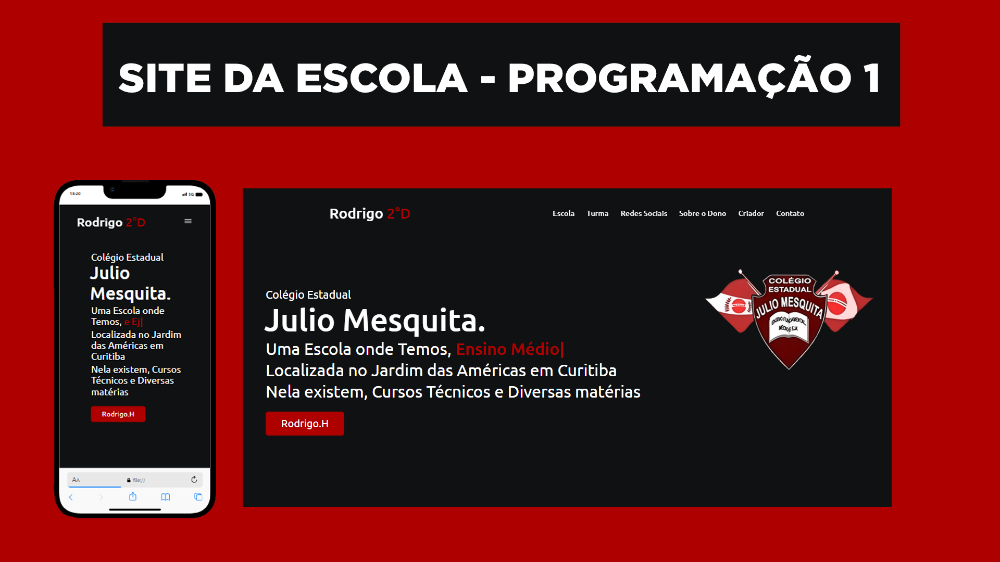

<h1 align="center">
  🧑‍💻 Site da Aula de Programação 1
</h1>

## :rocket: Sobre o projeto
Este é um site de uma turma de colégio estadual para matéria de prgramação.

## :computer: Programador:
Rodrigo Henrick - 2ºD | 2024.

## :computer: Tecnologias usadas:

- `Javascript`
- `HTML`
- `CSS`

## :bulb: Telas

